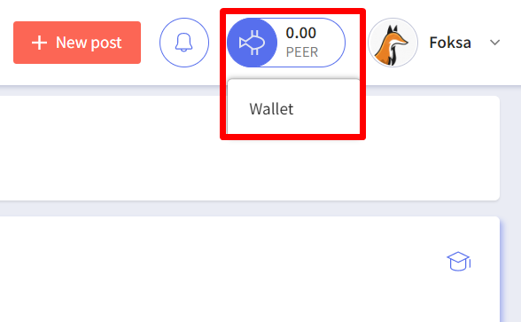
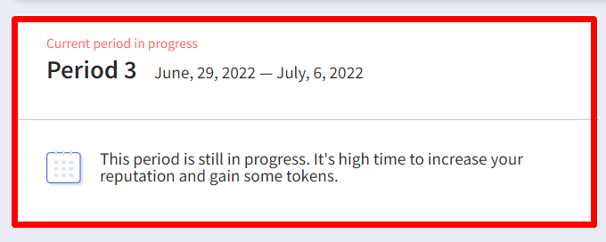
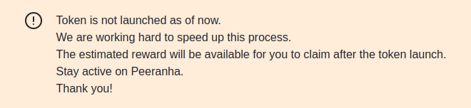

# Frequently Asked Questions

## About Peeranha

### What is Peeranha?

Peeranha is a decentralized knowledge-sharing protocol for Web3 where communities truly own their knowledge and earned reputation. Peeranha is built on a blockchain and it is owned by the community rather than by a single organization.

<!-- ### How is Peeranha different from other question and answer websites?

Unlike other question and answer websites where an organization owns the website and all the data generated from users, Peeranha is owned by the community and rewards are distributed to community members for their contributions. -->

### How does it work?

Peeranha is built using smart contracts on the Polygon blockchain. Large content is stored via distributed storage (IPFS) and only hashes of all documents are posted on the blockchain to save expensive blockchain storage. Reputation, privileges, moderation, rewards and all other rules are built into smart contracts and are visible to anyone.

<!-- ### Where do tokens for rewards come from?

Peeranha continually creates new tokens once a week until the total supply of tokens is reached. For a currency, this is known as inflation. Every week, newly created tokens are transferred to the reward pool. This weekly reward pool is distributed proportionally across users who contributed to the community during the week. -->

### What Blockchain is Peeranha built on?

Peeranha is powered by Polygon blockchain. Polygon provides short confirmation times for transactions and does not require users to pay any transaction fees.

<!-- ### What is the cryptocurrency of Peeranha?

Peeranha uses its own crypto-token (or cryptocurrency) called PEER.

### How can I earn crypto tokens on Peeranha?

All activities on the protocol that are considered valuable for the community are rewarded in PEER tokens. Contributions that earn tokens may include posting a detailed question, providing a helpful answer or acting as a moderator. -->

### Where can I learn more?

The best ways to learn more about us is to join our [Twitter](https://twitter.com/peeranhaio), read our [blog](https://medium.com/peeranha) or send us an email to <hello@peeranha.io>.  You can also post your questions on the Peeranha community on the protocol.

## Account

## Communities

### What is community?

Community is an area on the protocol dedicated to posts and answers for a specific topic.

### How are new communities and tags created?

During the first year, the Peeranha team will be able to create communities. Contact support at <hello@peeranha.io>  if you’re interested in creating a community for your project.

## Posts, Answers and Comments

### What is a good post?

- Try to make posts that are relevant to the community where you ask them
- Your post should require a solution or explanation, not state an opinion
- Provide as much detail as possible
- Provide code examples, if applicable

### What are the differences between Discussion and Expert Posts?

#### Discussion post. 
A post not requiring expertise or experience to answer can be one of the following:

- Subjective opinion exchange;
- Brainstorming;
- Feedback or review request;
- Answer is widely known.

#### Expert post. 
A post that requires one of the following:

- A solution to a problem that requires expert knowledge or experience;
- Source of information or resources on a specific subject that is not easily found;
- Requires an instruction or recipe;
- Explanation or clarification of the information that is complicated to comprehend.

### Moderation

If moderators decide that a wrong post type was chosen, they can change its type and the rewards will change according to the post type.

### How should I format posts and answers?

Posts and answers can be formatted using HTML editor or markdown syntax.

Markdown cheat-sheet can be found here: https://www.markdownguide.org/cheat-sheet/

### Do I have to tag my post?

Yes, at least one tag is required for each post. You should select the tags that are most relevant to the post.

### How are posts, answers, and comments moderated?

For the first year, the Peeranha team will act as moderators (can delete posts, answers, and comments) but as the community matures, this function will be moved to other individuals in the community.

### How can posts, answers and comments be deleted?

Users and moderators can delete posts, answers, and comments. This action can influence the reputation of a user. Read more 
[How can I earn or lose reputation points?](#section_id_4_2)

### Will I be notified if my post is deleted?

Notifications are not available in the first release. This functionality will be added in future versions.

## Status, Reputation and Privileges

### What user statuses are available on Peeranha?

| Status name | reputation points   |
| ----------- | ------------------- |
| Stranger    | 0 ... 99            |
| Newbie      | 100 ... 499         |
| Junior      | 500-999             |
| Resident    | 1000 ... 2499       |
| Senior      | 2500 ... 4999       |
| Hero        | 5000 ... 9999       |
| Superhero   | 10000               |

### NFTs

Among our users, we're distributing collectible NFTs for achieving a certain status among the first on the Peeranha protocol. These status NFTs are limited, and once they're all distributed among Peeranha users, we're not planning on making more.  
To check how many more reputation points you need to achieve your next status:

1. Visit your profile;
1. Click NFTs;
1. Check the progress bar below each status NFT;
1. Continue to be active on Peeranha;
1. Achieve a certain status and get your hands on a desirable NFT.

###  How can I earn or lose reputation points? 

The simple way to earn reputation points is to be helpful to a community and its members: ask relevant questions, provide quality answers, post tutorials, and be respectful to others.  

**You earn points when:**  
 
                                                                        

Expert post type
     
              
                                                             
| Action or Event                                                                     | reputation points   |
| ----------------------------------------------------------------------------------- | :-----------------: |
| **Expert post accepted as correct.** It means that your answer to a post was marked as , by the author of the post. You get reputation points.                                                      | 15                  | 
| **Expert post upvoted.** It means that some of the users of a community upvoted your post. You get reputation points.                                                                               | 5                   |
| **Expert answer upvoted.** It means that  some of the users of a community found your answer helpful and upvoted it. You get reputation points.                                                                               | 10                  |                           
| **Accept answer as correct for Expert post.** It means that the author of the post marked your answer as . The author of the post gets reputation points.                                            | 2                   |  
                                 

Discussion post type
 

| Action or Event                                                                     | reputation points   |
| ----------------------------------------------------------------------------------- | :-----------------: |
| **Discussion answer accepted as correct.** It means that your answer to a post was marked as  by the author of the post. You get reputation points.                                                      | 3                   |        
| **Discussion post upvoted.** It means that some of the users of a community upvoted your post. You get reputation points.                                                                               | 1                   |    
| **Discussion answer upvoted.** It means that  some of the users of a community found your answer helpful and upvoted it. You get reputation points.                                                                               | 2                   |
| **Accept answer as correct for Discussion post.** It means that the author of the post marked your answer as . The author of the post gets reputation points.                                            | 1                   |
     

Tutorial post type
 
                                                                        
| Action or Event                                                                     | reputation points   |
| ----------------------------------------------------------------------------------- | :-----------------: |
| Tutorial upvoted. It means that some of the users found your tutorial helpful they upvoted it. You get reputation points.                                                                               | 5                   |
  
Unfortunately there’s a chance that you may lose your reputation points. It depends on multiple factors: you provided an incomplete answer, the same question was asked many times, or maybe you broke the main rule to be respectful to others.	 

    
**You lose points when:**

All post type
 
                                                                         
| Action or Event                                                                     | reputation points   |
| ----------------------------------------------------------------------------------- | :-----------------: |
| **Expert post downvoted.** It means that other users didn’t like the post for some reason, they downvoted it. The author of the post loses reputation points.                                                                    | -2                  |
| **Expert answer downvoted.** It means that other users didn’t find the answer helpful and they downvoted it. The author of the answer loses reputation points.                                                                    | -2                  |  
| **Discussion post downvoted.** It means that other users didn’t like the post for some reason, they downvoted it. The author of the post loses reputation points.                                                              | -1                  | 
| **Discussion answer downvoted.** It means that other users didn’t find the answer helpful and they downvoted it. The author of the answer loses reputation points.                                                              | -1                  |
| **Downvote post.** It means that other users didn’t like the post for some reason, they downvoted it. The users who downvoted the post lose reputation points.                                                                    | -1                  |
| **Downvote answer.** It means that other users didn’t find the answer helpful, they downvoted it. The users who downvoted the answer lose reputation points.                                                                    | -1                  |
| Delete own post.                                                                    | -1                  |
| Delete own answer.                                                                  | -1                  |
| Delete own comment.                                                                 |  0                  |
| Moderator deletes your post or answer.                                              | -2                  |
| Moderator deletes your comment.                                                     | -1                  |
| **Tutorial downvoted.** It means that some users didn’t find the tutorial helpful, they downvoted it. The author of the tutorial loses reputation points. | -2 |
| **Downvote tutorial.**  It means that other users didn’t find the tutorial helpful, they downvoted it. The users who downvoted the tutorial lose reputation points. | -2 |

No worries if you lost some reputation points. There’s a way to improve the situation. 

**You get extra points when:**

Expert post type

                                                                                              
| Action or Event                                                                     | reputation points   |
| ----------------------------------------------------------------------------------- | :-----------------: |
| Post answered within 15 min after the post was published.                           | 5                   |
| Answer first to a post.                                                             | 5                   |
| Fulfill these two conditions at one go.                                             | 10                  |

Discussion post type

                                                                                      
| Action or Event                                                                     | reputation points   |
| ----------------------------------------------------------------------------------- | :-----------------: |
| Post answered within 15 min after the post was published.                           | 1                   |
| Answer first to a post.                                                             | 1                   |
| Fulfill these two conditions at one go.                                             | 2                   |

### What privileges are available to Peeranha users and what are reputation requirements?

| Action or Event                                   | Reputation points |
| --------------------------------------------------| ----------------- |
| Create post                                       | 0                 |
| Post answer                                       | 0                 |
| Post a comment under one’s own post or answer     | 0                 |
| Post comment under post or comment                | 35                |
| Upvote a post or answer                           | 35                |
| Downvote a post or answer                         | 100               |

## Token

### What is the name of token on Peeranha?

PEER

### Is PEER listed on any exchange?

No, PEER is not listed on any exchange yet. We will notify the community as soon as this happens.

### What is total supply?

The total supply of the PEER token is 1 000 000 000 PEER

### What is the token allocation?

- 60% of PEER will be created by emission and used as initial rewards to users for their contributions
- 20% for founders and team rewards
- 20% for funding

### What is the emission rate?

New tokens are created once per week. The maximum starting emission is 1 000 000 PEER per week (depends on user activity). The emission is reduced by 7% every 52 weeks.

### Period

Peeranha distributes PEER token rewards to its users in periods. The number of periods is not limited. 
Each period is one week long. You can check the current period in your wallet.  
Click the Wallet button > check current period in progress.

User reward in PEER tokens depends on the number of reputation points received during the particular period. The more active you are, the more tokens you get.
  
_Note: Token is not launched as of now. We are working hard to speed up this process. The estimated reward will be available for you to claim after the token launch. Stay active on Peeranha. Thank you!_

## Rewards

### When are rewards paid out?

Rewards are paid out weekly.

To prevent abuse of the system, there is a safety period of one additional week before rewards are available for users.

For example:

- Week 1: users engage on site
- Week 2: rewards are allocated but not distributed
- Week 3: rewards from week 1’s contributions are distributed estimated rewards for week 1 will be visible after the start of week 2 but available to be received only after the start of week 3.

<!--### How are user rewards calculated?

Exact user rewards depends on the user activity during a given period. The maximum size of the weekly reward pool is equal to maximum weekly emission of the token.

If total rating points earned by all of the users during the week multiplied by 10 is less than maximum token emission, then the reward is simply 10 PEERs per rating point.

Otherwise, the reward pool size is equal to the maximum weekly token emission and tokens are distributed proportionally to rating points earned by users.-->

## Messenger Bots

### Telegram

Telegram bot is created to give Users an ability to receive notifications about new questions, asked in their favorite communities in Telegram Messenger. Users are able to set notifications in private messages, groups or channels.

To set the bot for private messages search for @PeeranhaBot and start a chat with it.

To set it in group/channel click "Add members" and add @PeeranhaBot.

**Commands for bot:**

/settings - set the auto answering, default community and tags for the chat

/subscribe - subscribes to the notifications from a community (e.g. /subscribe Peeranha)

/unsubscribe - unsubscribes from the notifications from a community (e.g. /unsubscribe Peeranha)

/communities - displays the communities that are available for subscription

/subscriptions - displays current subscriptions

/postquestion _Question Text_ - ask a question in one step (Default Community and Tags have to be set in the chat settings)

**Commands for private chat:**

/postquestion - ask a question

/linkaccount - add telos account

/unlinkaccount - unlink telos account

/updatedisplayname - update display name

_Post an answer directly from Telegram by using "Reply" action on a notification message about a posted question._

_If you haven't linked your Telegram account to Peeranha profile yet, bot will allow you to post questions or answers with a Temporary created account. Follow the <a href="https://peeranha.io/faq/#section_id_1_4" style="color: #576fed; font-style: italic;">link</a> to learn more details._

## Boost

### What is a Boost?

Boost is a multiplier of the common PEER token reward that users are getting by increasing their rating points on Peeranha. The multiplier value depends on the User’s token investment amount called Stake. The highest Stake on Peeranha will give its owner the biggest Boost multiplier – X4. Other users, who made a lower Stake, compared to maximum stake, will get the calculated Boost multiplier according to their Stake.

### How to make a stake?

To make a stake, navigate to the Boost page from the wallet drop-down menu and fill the “Your Stake” form. Boost will be activated in the next period. Staked PEER tokens will be frozen and out of use until you unstake them.
The stake will always migrate from one period to another unless it is changed or withdrawn. Changes to the stake can be made anytime, but they will be applied in the next period.

### Why are my tokens frozen?

It's made to use these tokens as additional capital for the founding needs. This system works like bank deposits.

To unlock the tokens, withdraw the Stake and in the next period the staked tokens will be returned, and Boost will be deactivated.

### When I can get my reward?

The reward with Boost is paid out to users with the same rules as a common reward. Learn more about it in FAQ “Rewards” section

## Promoted Questions

### What is a Promoted question?

Promoted question is a good option to increase the probability of a question being noticed and answered on Peeranha. If the question is promoted, it will be pinned to the top of the questions list filtered by the related community on Peeranha, and in the related Single Community Mode.

### How to Promote a question?

To promote the question, fill the Promote question field on the Ask Question page for the new question or Edit Question page for an existing question. Enter how many hours the question will stay promoted. 1 hour of the promotion costs 2 PEER tokens.

### How is Promoted question displayed?

Promoted questions are displayed in the questions list filtered by the related community on Peeranha, and in the related Single Community Mode. Promoted questions are highlighted with special border color and marked with a 'Promoted' label.

If there are 3 or less Promoted questions in the Community then they are displayed on the top of the questions list in chronological order starting from the newest promoted question.

If there are more than 3 Promoted questions in the Community then 3 of them are chosen randomly and they are displayed on the top of the questions list in random order. The displayed questions and their order is changing every time after reloading or navigating to the Questions list page from other pages.

At the same time, the original copies of Promoted questions will also be displayed in the general list of Community's questions below the Promoted questions.

### Why can`t I promote my question?

If an error message occurs when trying to Promote a question and the question is posted without the promotion, please try to enable pop-ups in the browser settings for this site. If it doesn't help, please contact our <a href="https://peeranha.io/support/#support_form" style="color: #576fed; font-style: italic;">support team</a>

